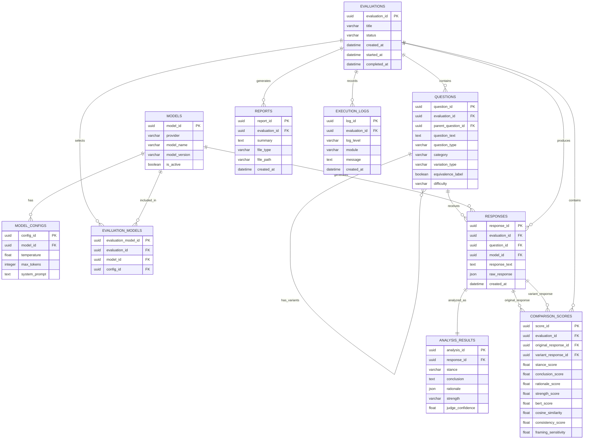
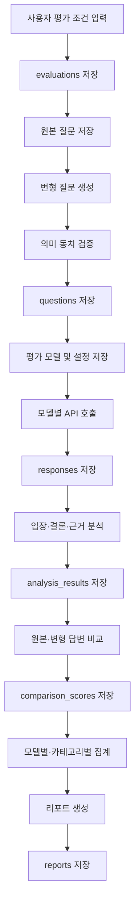

# DB 설계서

> 프로젝트명: KoSI (Korean Semantic Invariance Benchmark)  
> 목적: 한국어 질문의 표현 변화에 따른 LLM 답변 일관성을 평가하기 위한 데이터 저장 구조 정의

---

## 1. 데이터베이스 개요

KoSI 시스템은 원본 질문과 의미가 동일한 변형 질문을 생성하고, GPT·Claude·Gemini 등 여러 LLM의 답변을 수집한 뒤 답변의 입장, 결론, 근거, 의미 유사도 등을 분석하여 일관성 점수를 산출한다.

데이터베이스는 다음 데이터를 통합 관리하는 것을 목적으로 한다.

- 사용자 또는 연구자가 생성한 평가 작업
- 원본 질문과 변형 질문
- 질문 카테고리 및 변형 유형
- 평가 대상 LLM 정보
- 모델별 답변 및 원본 API 응답
- 답변 분석 결과
- 답변 간 비교 점수
- 평가 결과 요약 및 리포트
- 실행 환경 및 오류 로그

### 1.1 데이터베이스 사용 목적

| 목적 | 설명 |
|---|---|
| 질문 데이터 관리 | 원본 질문, 변형 질문, 카테고리, 난이도 등을 저장한다. |
| 모델 정보 관리 | GPT, Claude, Gemini 등 평가 대상 모델의 정보를 저장한다. |
| 답변 수집 | 각 질문에 대한 모델별 답변과 생성 조건을 저장한다. |
| 분석 결과 관리 | 입장, 결론, 근거, 결론 강도 등의 분석 결과를 저장한다. |
| 점수 관리 | BERTScore, 코사인 유사도, LLM Judge 결과와 종합 점수를 저장한다. |
| 평가 이력 관리 | 과거 평가 작업의 실행 조건과 결과를 조회할 수 있도록 한다. |
| 리포트 관리 | 평가 결과 요약 및 다운로드 파일 정보를 저장한다. |

### 1.2 권장 DBMS

개발 초기에는 설정과 배포가 간단한 SQLite를 사용하고, 다중 사용자 환경이나 대규모 데이터 처리가 필요할 경우 PostgreSQL로 전환한다.

| 구분 | 권장 DBMS |
|---|---|
| 초기 개발 및 시연 | SQLite |
| 배포 및 운영 | PostgreSQL |
| ORM | SQLAlchemy |
| 마이그레이션 | Alembic |

---

## 2. ERD



---

## 3. 테이블 목록

| 번호 | 테이블명 | 설명 |
|---:|---|---|
| 1 | `evaluations` | 평가 작업의 기본 정보와 진행 상태를 저장한다. |
| 2 | `questions` | 원본 질문과 변형 질문을 저장한다. |
| 3 | `models` | 평가 대상 LLM 정보를 저장한다. |
| 4 | `model_configs` | 모델별 생성 조건과 프롬프트 설정을 저장한다. |
| 5 | `evaluation_models` | 평가 작업과 선택된 모델의 연결 정보를 저장한다. |
| 6 | `responses` | 모델이 생성한 답변과 원본 API 응답을 저장한다. |
| 7 | `analysis_results` | 답변의 입장, 결론, 근거, 강도 분석 결과를 저장한다. |
| 8 | `comparison_scores` | 원본 답변과 변형 답변 간 비교 점수를 저장한다. |
| 9 | `reports` | 평가 결과 요약과 다운로드 파일 정보를 저장한다. |
| 10 | `execution_logs` | 실행 과정에서 발생한 상태, 오류 및 경고 로그를 저장한다. |

---

## 4. 테이블별 상세 정의

### 4.1 `evaluations`

평가 작업의 기본 정보와 전체 진행 상태를 저장한다.

| 컬럼명 | 자료형 | NULL | 키 | 기본값 | 설명 |
|---|---|---:|---|---|---|
| `evaluation_id` | UUID | N | PK | 자동 생성 | 평가 작업 고유 ID |
| `title` | VARCHAR(200) | N |  |  | 평가 작업명 |
| `description` | TEXT | Y |  | NULL | 평가 설명 |
| `status` | VARCHAR(20) | N |  | `PENDING` | 평가 진행 상태 |
| `total_questions` | INTEGER | N |  | 0 | 전체 질문 수 |
| `completed_responses` | INTEGER | N |  | 0 | 생성 완료 답변 수 |
| `created_at` | DATETIME | N |  | 현재 시각 | 생성 일시 |
| `started_at` | DATETIME | Y |  | NULL | 평가 시작 일시 |
| `completed_at` | DATETIME | Y |  | NULL | 평가 완료 일시 |
| `updated_at` | DATETIME | N |  | 현재 시각 | 마지막 수정 일시 |

#### 상태값

| 값 | 의미 |
|---|---|
| `PENDING` | 평가 대기 |
| `RUNNING` | 모델 답변 생성 중 |
| `ANALYZING` | 답변 분석 및 점수 산출 중 |
| `COMPLETED` | 평가 완료 |
| `FAILED` | 평가 실패 |
| `CANCELLED` | 사용자 취소 |

---

### 4.2 `questions`

원본 질문과 변형 질문을 저장한다. 변형 질문은 `parent_question_id`를 통해 원본 질문과 연결한다.

| 컬럼명 | 자료형 | NULL | 키 | 기본값 | 설명 |
|---|---|---:|---|---|---|
| `question_id` | UUID | N | PK | 자동 생성 | 질문 고유 ID |
| `evaluation_id` | UUID | N | FK |  | 평가 작업 ID |
| `parent_question_id` | UUID | Y | FK | NULL | 원본 질문 ID |
| `question_text` | TEXT | N |  |  | 질문 내용 |
| `question_type` | VARCHAR(20) | N |  |  | 원본 또는 변형 구분 |
| `category` | VARCHAR(50) | N |  |  | 질문 카테고리 |
| `variation_type` | VARCHAR(50) | Y |  | NULL | 변형 유형 |
| `equivalence_label` | BOOLEAN | Y |  | NULL | 의미 동치 여부 |
| `equivalence_confidence` | FLOAT | Y |  | NULL | 의미 동치 신뢰도 |
| `difficulty` | VARCHAR(20) | N |  | `NORMAL` | 난이도 |
| `negation_depth` | INTEGER | N |  | 0 | 부정 표현 중첩 횟수 |
| `frame_type` | VARCHAR(50) | Y |  | NULL | 강조된 가치 또는 관점 |
| `expected_stance` | VARCHAR(30) | Y |  | NULL | 기준 입장 또는 정답 |
| `is_active` | BOOLEAN | N |  | TRUE | 평가 사용 여부 |
| `created_at` | DATETIME | N |  | 현재 시각 | 생성 일시 |
| `updated_at` | DATETIME | N |  | 현재 시각 | 수정 일시 |

#### 질문 유형

| 값 | 의미 |
|---|---|
| `ORIGINAL` | 원본 질문 |
| `VARIANT` | 의미 동치 변형 질문 |
| `FRAMING` | 프레이밍 변형 질문 |
| `NON_EQUIVALENT` | 비동치 대조 질문 |

#### 카테고리

| 값 | 의미 |
|---|---|
| `FACT` | 단순 사실 |
| `LOGIC` | 논리 추론 |
| `ETHICS` | 윤리 판단 |
| `NEGATION` | 중첩 부정 |
| `KOREAN_CONTEXT` | 한국 사회 특화 |
| `FRAMING` | 프레이밍 |

#### 변형 유형

| 값 | 의미 |
|---|---|
| `SYNONYM` | 동의어 교체 |
| `WORD_ORDER` | 어순 변경 |
| `STYLE` | 문체 변경 |
| `POLARITY` | 긍정·부정 변환 |
| `VOICE` | 능동·수동 변환 |
| `NEGATION` | 중첩 부정 |
| `HONORIFIC` | 높임법 변경 |
| `FRAMING` | 관점 또는 프레임 변화 |

---

### 4.3 `models`

평가 대상 LLM의 제공사, 모델명, 버전 정보를 저장한다.

| 컬럼명 | 자료형 | NULL | 키 | 기본값 | 설명 |
|---|---|---:|---|---|---|
| `model_id` | UUID | N | PK | 자동 생성 | 모델 고유 ID |
| `provider` | VARCHAR(50) | N |  |  | 모델 제공사 |
| `model_name` | VARCHAR(100) | N |  |  | 화면 표시용 모델명 |
| `model_version` | VARCHAR(150) | N |  |  | 실제 API 호출 모델명 |
| `description` | TEXT | Y |  | NULL | 모델 설명 |
| `is_active` | BOOLEAN | N |  | TRUE | 사용 여부 |
| `created_at` | DATETIME | N |  | 현재 시각 | 등록 일시 |
| `updated_at` | DATETIME | N |  | 현재 시각 | 수정 일시 |

#### 제공사 예시

| 제공사 | 모델 |
|---|---|
| `OPENAI` | GPT |
| `ANTHROPIC` | Claude |
| `GOOGLE` | Gemini |

---

### 4.4 `model_configs`

모델 호출 시 적용되는 생성 조건과 프롬프트 버전을 저장한다.

| 컬럼명 | 자료형 | NULL | 키 | 기본값 | 설명 |
|---|---|---:|---|---|---|
| `config_id` | UUID | N | PK | 자동 생성 | 설정 고유 ID |
| `model_id` | UUID | N | FK |  | 모델 ID |
| `config_name` | VARCHAR(100) | N |  |  | 설정 이름 |
| `temperature` | FLOAT | N |  | 0.0 | 생성 다양성 |
| `max_tokens` | INTEGER | N |  | 1000 | 최대 출력 토큰 |
| `top_p` | FLOAT | Y |  | NULL | 확률 질량 기준 |
| `system_prompt` | TEXT | N |  |  | 공통 시스템 프롬프트 |
| `prompt_version` | VARCHAR(30) | N |  | `1.0` | 프롬프트 버전 |
| `is_default` | BOOLEAN | N |  | FALSE | 기본 설정 여부 |
| `created_at` | DATETIME | N |  | 현재 시각 | 생성 일시 |

---

### 4.5 `evaluation_models`

하나의 평가 작업에 여러 모델을 연결하기 위한 중간 테이블이다.

| 컬럼명 | 자료형 | NULL | 키 | 기본값 | 설명 |
|---|---|---:|---|---|---|
| `evaluation_model_id` | UUID | N | PK | 자동 생성 | 연결 정보 고유 ID |
| `evaluation_id` | UUID | N | FK |  | 평가 작업 ID |
| `model_id` | UUID | N | FK |  | 모델 ID |
| `config_id` | UUID | N | FK |  | 사용한 모델 설정 ID |
| `status` | VARCHAR(20) | N |  | `PENDING` | 모델별 실행 상태 |
| `created_at` | DATETIME | N |  | 현재 시각 | 생성 일시 |

---

### 4.6 `responses`

질문별 모델 응답과 API 호출 정보를 저장한다.

| 컬럼명 | 자료형 | NULL | 키 | 기본값 | 설명 |
|---|---|---:|---|---|---|
| `response_id` | UUID | N | PK | 자동 생성 | 답변 고유 ID |
| `evaluation_id` | UUID | N | FK |  | 평가 작업 ID |
| `question_id` | UUID | N | FK |  | 질문 ID |
| `model_id` | UUID | N | FK |  | 모델 ID |
| `config_id` | UUID | N | FK |  | 모델 설정 ID |
| `response_text` | TEXT | N |  |  | 모델 답변 |
| `raw_response` | JSON | Y |  | NULL | 수정되지 않은 API 응답 |
| `prompt_tokens` | INTEGER | Y |  | NULL | 입력 토큰 수 |
| `completion_tokens` | INTEGER | Y |  | NULL | 출력 토큰 수 |
| `latency_ms` | INTEGER | Y |  | NULL | 응답 시간 |
| `finish_reason` | VARCHAR(50) | Y |  | NULL | 응답 종료 사유 |
| `api_status` | VARCHAR(20) | N |  | `SUCCESS` | API 호출 상태 |
| `error_message` | TEXT | Y |  | NULL | 오류 내용 |
| `created_at` | DATETIME | N |  | 현재 시각 | 답변 생성 일시 |

---

### 4.7 `analysis_results`

하나의 모델 답변에 대한 구조화 분석 결과를 저장한다.

| 컬럼명 | 자료형 | NULL | 키 | 기본값 | 설명 |
|---|---|---:|---|---|---|
| `analysis_id` | UUID | N | PK | 자동 생성 | 분석 결과 고유 ID |
| `response_id` | UUID | N | FK, UNIQUE |  | 답변 ID |
| `stance` | VARCHAR(30) | N |  |  | 답변 입장 |
| `conclusion` | TEXT | N |  |  | 핵심 결론 |
| `rationale` | JSON | Y |  | NULL | 핵심 근거 목록 |
| `rationale_categories` | JSON | Y |  | NULL | 근거 범주 |
| `strength` | VARCHAR(30) | N |  |  | 결론 강도 |
| `conditional_expression` | TEXT | Y |  | NULL | 조건 표현 |
| `judge_confidence` | FLOAT | Y |  | NULL | 분석 신뢰도 |
| `judge_raw_result` | JSON | Y |  | NULL | LLM Judge 원본 결과 |
| `created_at` | DATETIME | N |  | 현재 시각 | 분석 일시 |

#### 입장 값

| 값 | 의미 |
|---|---|
| `SUPPORT` | 찬성 |
| `OPPOSE` | 반대 |
| `NEUTRAL` | 중립 |
| `CONDITIONAL_SUPPORT` | 조건부 찬성 |
| `CONDITIONAL_OPPOSE` | 조건부 반대 |
| `UNDETERMINED` | 판정 불가 |

#### 결론 강도 값

| 값 | 의미 |
|---|---|
| `STRONG` | 확정적 |
| `MODERATE` | 일반적 |
| `CONDITIONAL` | 조건부 |
| `RESERVED` | 유보적 |
| `UNDETERMINED` | 판정 불가 |

---

### 4.8 `comparison_scores`

원본 질문 답변과 변형 질문 답변을 비교한 평가 점수를 저장한다.

| 컬럼명 | 자료형 | NULL | 키 | 기본값 | 설명 |
|---|---|---:|---|---|---|
| `score_id` | UUID | N | PK | 자동 생성 | 점수 고유 ID |
| `evaluation_id` | UUID | N | FK |  | 평가 작업 ID |
| `model_id` | UUID | N | FK |  | 평가 모델 ID |
| `original_response_id` | UUID | N | FK |  | 원본 질문 답변 ID |
| `variant_response_id` | UUID | N | FK |  | 변형 질문 답변 ID |
| `stance_score` | FLOAT | N |  | 0 | 입장 일치 점수 |
| `conclusion_score` | FLOAT | N |  | 0 | 결론 일치 점수 |
| `rationale_score` | FLOAT | N |  | 0 | 근거 일치 점수 |
| `strength_score` | FLOAT | N |  | 0 | 결론 강도 일치 점수 |
| `bert_score` | FLOAT | Y |  | NULL | BERTScore |
| `cosine_similarity` | FLOAT | Y |  | NULL | 코사인 유사도 |
| `semantic_score` | FLOAT | N |  | 0 | 정규화 의미 유사도 점수 |
| `llm_judge_score` | FLOAT | Y |  | NULL | LLM Judge 점수 |
| `consistency_score` | FLOAT | N |  | 0 | 최종 일관성 점수 |
| `framing_sensitivity` | FLOAT | Y |  | NULL | 프레이밍 민감도 |
| `mismatch_reason` | JSON | Y |  | NULL | 불일치 사유 |
| `created_at` | DATETIME | N |  | 현재 시각 | 점수 생성 일시 |

#### 일관성 점수 배점

| 항목 | 배점 |
|---|---:|
| 입장 일치도 | 40점 |
| 핵심 결론 일치도 | 20점 |
| 근거 일치도 | 20점 |
| 결론 강도 일치도 | 10점 |
| 의미 유사도 | 10점 |
| 합계 | 100점 |

---

### 4.9 `reports`

평가 결과 요약과 생성된 리포트 파일 정보를 저장한다.

| 컬럼명 | 자료형 | NULL | 키 | 기본값 | 설명 |
|---|---|---:|---|---|---|
| `report_id` | UUID | N | PK | 자동 생성 | 리포트 고유 ID |
| `evaluation_id` | UUID | N | FK |  | 평가 작업 ID |
| `report_type` | VARCHAR(30) | N |  |  | 리포트 형식 |
| `summary` | TEXT | Y |  | NULL | 자동 분석 요약 |
| `insights` | JSON | Y |  | NULL | 모델별 주요 분석 결과 |
| `file_path` | VARCHAR(500) | Y |  | NULL | 파일 저장 경로 |
| `file_name` | VARCHAR(255) | Y |  | NULL | 파일명 |
| `created_at` | DATETIME | N |  | 현재 시각 | 생성 일시 |

#### 리포트 형식

- `CSV`
- `JSON`
- `PDF`
- `HTML`

---

### 4.10 `execution_logs`

평가 과정에서 발생한 진행 상태, 경고, 오류를 저장한다.

| 컬럼명 | 자료형 | NULL | 키 | 기본값 | 설명 |
|---|---|---:|---|---|---|
| `log_id` | UUID | N | PK | 자동 생성 | 로그 고유 ID |
| `evaluation_id` | UUID | Y | FK | NULL | 평가 작업 ID |
| `response_id` | UUID | Y | FK | NULL | 관련 답변 ID |
| `log_level` | VARCHAR(20) | N |  | `INFO` | 로그 수준 |
| `module` | VARCHAR(100) | N |  |  | 발생 모듈 |
| `message` | TEXT | N |  |  | 로그 내용 |
| `details` | JSON | Y |  | NULL | 추가 정보 |
| `created_at` | DATETIME | N |  | 현재 시각 | 생성 일시 |

#### 로그 수준

- `DEBUG`
- `INFO`
- `WARNING`
- `ERROR`
- `CRITICAL`

---

## 5. 테이블 관계

| 부모 테이블 | 자식 테이블 | 관계 | 설명 |
|---|---|---|---|
| `evaluations` | `questions` | 1:N | 하나의 평가에 여러 질문이 포함된다. |
| `questions` | `questions` | 1:N | 하나의 원본 질문은 여러 변형 질문을 가진다. |
| `models` | `model_configs` | 1:N | 하나의 모델은 여러 생성 설정을 가질 수 있다. |
| `evaluations` | `evaluation_models` | 1:N | 하나의 평가에 여러 모델이 선택될 수 있다. |
| `models` | `evaluation_models` | 1:N | 하나의 모델은 여러 평가에 사용될 수 있다. |
| `questions` | `responses` | 1:N | 하나의 질문에 여러 모델의 답변이 생성된다. |
| `models` | `responses` | 1:N | 하나의 모델은 여러 질문에 답변한다. |
| `responses` | `analysis_results` | 1:1 | 하나의 답변에 하나의 구조화 분석 결과가 연결된다. |
| `responses` | `comparison_scores` | 1:N | 하나의 답변이 여러 비교 점수에 사용될 수 있다. |
| `evaluations` | `reports` | 1:N | 하나의 평가에서 여러 형식의 리포트를 생성할 수 있다. |
| `evaluations` | `execution_logs` | 1:N | 하나의 평가 과정에 여러 로그가 기록된다. |

---

## 6. 제약조건

### 6.1 기본키 제약조건

모든 테이블은 UUID 형식의 기본키를 사용한다.

| 테이블 | 기본키 |
|---|---|
| `evaluations` | `evaluation_id` |
| `questions` | `question_id` |
| `models` | `model_id` |
| `model_configs` | `config_id` |
| `evaluation_models` | `evaluation_model_id` |
| `responses` | `response_id` |
| `analysis_results` | `analysis_id` |
| `comparison_scores` | `score_id` |
| `reports` | `report_id` |
| `execution_logs` | `log_id` |

### 6.2 외래키 제약조건

| 자식 테이블 | 외래키 | 참조 테이블 |
|---|---|---|
| `questions` | `evaluation_id` | `evaluations.evaluation_id` |
| `questions` | `parent_question_id` | `questions.question_id` |
| `model_configs` | `model_id` | `models.model_id` |
| `evaluation_models` | `evaluation_id` | `evaluations.evaluation_id` |
| `evaluation_models` | `model_id` | `models.model_id` |
| `evaluation_models` | `config_id` | `model_configs.config_id` |
| `responses` | `evaluation_id` | `evaluations.evaluation_id` |
| `responses` | `question_id` | `questions.question_id` |
| `responses` | `model_id` | `models.model_id` |
| `responses` | `config_id` | `model_configs.config_id` |
| `analysis_results` | `response_id` | `responses.response_id` |
| `comparison_scores` | `original_response_id` | `responses.response_id` |
| `comparison_scores` | `variant_response_id` | `responses.response_id` |
| `reports` | `evaluation_id` | `evaluations.evaluation_id` |
| `execution_logs` | `evaluation_id` | `evaluations.evaluation_id` |

### 6.3 UNIQUE 제약조건

| 테이블 | 컬럼 | 설명 |
|---|---|---|
| `models` | `provider`, `model_version` | 같은 제공사의 동일 모델 버전 중복 방지 |
| `evaluation_models` | `evaluation_id`, `model_id` | 하나의 평가에 동일 모델 중복 선택 방지 |
| `responses` | `evaluation_id`, `question_id`, `model_id` | 동일 평가·질문·모델의 답변 중복 방지 |
| `analysis_results` | `response_id` | 하나의 답변에 하나의 분석 결과만 허용 |
| `comparison_scores` | `original_response_id`, `variant_response_id`, `model_id` | 동일 답변 쌍의 중복 비교 방지 |

### 6.4 CHECK 제약조건

| 대상 | 조건 |
|---|---|
| `temperature` | 0 이상 2 이하 |
| `max_tokens` | 1 이상 |
| `equivalence_confidence` | 0 이상 1 이하 |
| `bert_score` | 0 이상 1 이하 |
| `cosine_similarity` | -1 이상 1 이하 |
| `consistency_score` | 0 이상 100 이하 |
| `framing_sensitivity` | 0 이상 100 이하 |
| `negation_depth` | 0 이상 |
| `prompt_tokens` | 0 이상 |
| `completion_tokens` | 0 이상 |

### 6.5 삭제 정책

| 관계 | 삭제 정책 |
|---|---|
| 평가 삭제 시 질문 | `ON DELETE CASCADE` |
| 평가 삭제 시 응답 | `ON DELETE CASCADE` |
| 평가 삭제 시 점수 | `ON DELETE CASCADE` |
| 평가 삭제 시 리포트 | `ON DELETE CASCADE` |
| 원본 질문 삭제 시 변형 질문 | `ON DELETE CASCADE` |
| 모델 삭제 시 응답 | 실제 삭제 대신 `is_active = FALSE` 권장 |
| 응답 삭제 시 분석 결과 | `ON DELETE CASCADE` |

---

## 7. 인덱스 설계

조회 속도 향상과 중복 데이터 방지를 위해 다음 인덱스를 생성한다.

| 인덱스명 | 테이블 | 대상 컬럼 | 목적 |
|---|---|---|---|
| `idx_evaluations_status` | `evaluations` | `status` | 평가 상태별 조회 |
| `idx_evaluations_created_at` | `evaluations` | `created_at` | 최근 평가 이력 조회 |
| `idx_questions_evaluation_id` | `questions` | `evaluation_id` | 평가별 질문 조회 |
| `idx_questions_parent_id` | `questions` | `parent_question_id` | 원본 질문별 변형 질문 조회 |
| `idx_questions_category` | `questions` | `category` | 카테고리별 조회 |
| `idx_questions_variation_type` | `questions` | `variation_type` | 변형 유형별 조회 |
| `idx_responses_evaluation_id` | `responses` | `evaluation_id` | 평가별 답변 조회 |
| `idx_responses_question_id` | `responses` | `question_id` | 질문별 답변 조회 |
| `idx_responses_model_id` | `responses` | `model_id` | 모델별 답변 조회 |
| `idx_analysis_response_id` | `analysis_results` | `response_id` | 답변 분석 결과 조회 |
| `idx_scores_evaluation_id` | `comparison_scores` | `evaluation_id` | 평가별 점수 조회 |
| `idx_scores_model_id` | `comparison_scores` | `model_id` | 모델별 점수 조회 |
| `idx_scores_consistency` | `comparison_scores` | `consistency_score` | 낮은 일관성 문항 조회 |
| `idx_logs_evaluation_id` | `execution_logs` | `evaluation_id` | 평가별 로그 조회 |
| `idx_logs_level` | `execution_logs` | `log_level` | 오류 수준별 로그 조회 |

### 7.1 복합 인덱스

```sql
CREATE INDEX idx_questions_eval_category
ON questions(evaluation_id, category);

CREATE INDEX idx_responses_eval_model
ON responses(evaluation_id, model_id);

CREATE INDEX idx_scores_eval_model
ON comparison_scores(evaluation_id, model_id);

CREATE INDEX idx_scores_eval_consistency
ON comparison_scores(evaluation_id, consistency_score);
```

---

## 8. 데이터 저장 흐름

### 8.1 전체 저장 흐름



### 8.2 단계별 처리

#### 1단계: 평가 작업 생성

사용자가 평가 제목, 원본 질문, 질문 카테고리, 변형 유형, 변형 개수, 평가 모델을 선택한다.

저장 테이블:

- `evaluations`
- `evaluation_models`

#### 2단계: 질문 저장

사용자가 입력한 원본 질문을 `questions`에 `ORIGINAL` 유형으로 저장한다.

AI가 생성한 변형 질문은 의미 동치 검증 후 다음 정보와 함께 저장한다.

- 원본 질문 ID
- 변형 질문 내용
- 변형 유형
- 의미 동치 여부
- 동치 신뢰도
- 난이도
- 프레임 유형

#### 3단계: 모델 답변 수집

선택한 GPT, Claude, Gemini 모델에 동일한 질문과 생성 조건을 전달한다.

각 모델의 응답을 `responses`에 저장한다.

저장 항목:

- 모델명과 모델 버전
- 질문 ID
- 답변 본문
- 원본 API 응답
- 입력·출력 토큰 수
- 응답 시간
- API 호출 상태

#### 4단계: 답변 분석

GPT 또는 별도의 Judge 모델을 사용하여 각 답변을 분석한다.

분석 결과는 `analysis_results`에 저장한다.

- 입장
- 핵심 결론
- 핵심 근거
- 근거 범주
- 결론 강도
- 조건 표현
- 분석 신뢰도

#### 5단계: 답변 비교 및 점수 산출

같은 모델이 생성한 원본 질문 답변과 변형 질문 답변을 비교한다.

다음 점수를 산출하여 `comparison_scores`에 저장한다.

- 입장 일치도
- 결론 일치도
- 근거 일치도
- 결론 강도 일치도
- BERTScore
- 코사인 유사도
- LLM Judge 점수
- Consistency Score
- Framing Sensitivity Score

#### 6단계: 결과 집계

저장된 점수를 이용하여 다음 결과를 계산한다.

- 모델별 평균 일관성 점수
- 카테고리별 평균 점수
- 변형 유형별 평균 점수
- 모델별 표준편차
- 프레이밍 민감도
- 낮은 일관성 문항 목록

#### 7단계: 리포트 생성

평가 결과를 CSV, JSON, PDF 또는 HTML 형식으로 생성한다.

생성된 파일의 경로와 분석 요약을 `reports`에 저장한다.

#### 8단계: 평가 완료 처리

모든 답변 생성과 분석이 완료되면 `evaluations.status`를 `COMPLETED`로 변경하고 `completed_at`을 저장한다.

오류가 발생한 경우에는 `execution_logs`에 오류 내용을 저장하고 평가 상태를 `FAILED` 또는 부분 실패 상태로 변경한다.

---

## 부록: 권장 초기 데이터 규모

| 항목 | 권장 수량 |
|---|---:|
| 원본 질문 | 30개 |
| 질문당 변형 질문 | 4개 |
| 전체 질문 | 150개 |
| 평가 모델 | 3개 |
| 예상 모델 답변 | 450개 |
| 예상 비교 점수 | 360개 |

계산 예시:

```text
원본 질문 30개 × 질문 묶음당 5개 × 모델 3개
= 총 450개 모델 답변
```

원본 질문 1개마다 변형 질문 4개가 생성되므로 모델별 비교 쌍은 4개이다.

```text
원본 질문 30개 × 변형 질문 4개 × 모델 3개
= 총 360개 답변 비교 결과
```